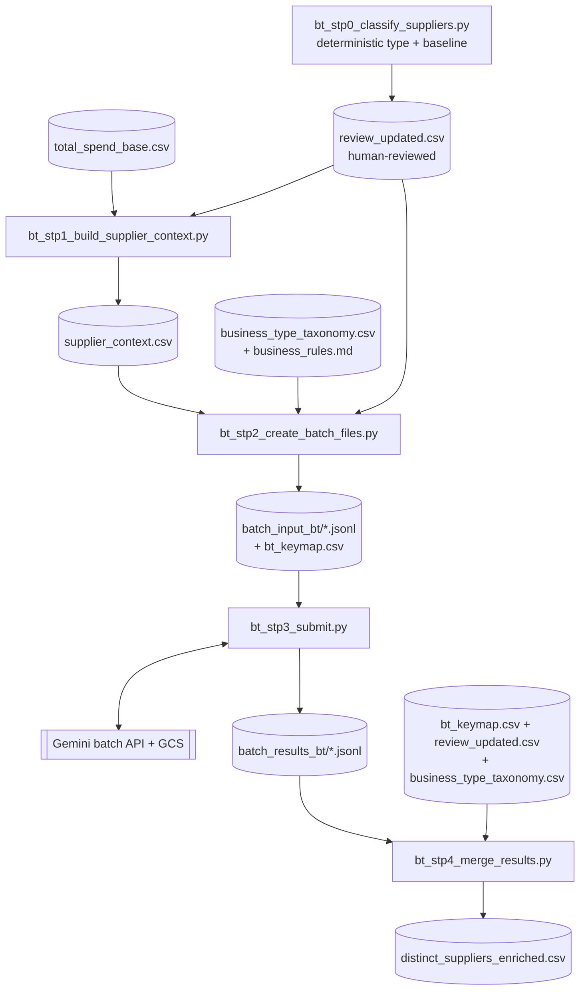

# Council Spend Enrichment — Pipelines

This repo holds **two independent pipelines** that classify UK council
procurement spend.

1. **Procurement-taxonomy enrichment** (`enrich_stp1…5`) — classifies aggregated
   spend against the 597-code procurement taxonomy via the Gemini Batch API.
2. **Business-type classification** (`bt_stp0_classify_suppliers` → `bt_stp1…4`) —
   classifies *suppliers* into a two-level business taxonomy (16 types / 85
   sub-types). This is the newer pipeline and the focus of most of this README.

The two pipelines share environment settings in `config.py` and helpers in
`utils.py`, but otherwise run separately — their own input/output folders,
manifests and GCS prefixes. All CSV outputs are written **utf-8-sig** (BOM).

---

## Dataflow — business-type pipeline



---

## Prerequisites

```bash
pip install pandas google-genai google-cloud-storage names-dataset openpyxl
gcloud auth application-default login
```

---

## Business-type pipeline — scripts & arguments

### `bt_stp0_classify_suppliers.py`  (upstream, deterministic)

Assigns the top-level `type` (Gov Agency, Department, Persons Name, Personal
Address, Redacted, Business, Nan) and a keyword `business_type` baseline. A
companion review file (`distinct_suppliers_review.xlsx`) with helper columns and
dropdowns is produced for human review; save it as
`distinct_suppliers_review_updated.csv` after setting `include_in_batch`.

- **In:** `distinct_suppliers_clean.csv`
- **Out:** `distinct_suppliers_classified.csv` / review workbook

### `bt_stp1_build_supplier_context.py`

Collapses the aggregated spend base to **one row per supplier**, keeping the
top-N distinct context values per field (ranked by spend) plus a prompt-ready
`context_descriptor`. Restricts output to suppliers flagged `include_in_batch=Y`.

- **In:** `total_spend_base.csv`, `distinct_suppliers_review_updated.csv`
- **Out:** `supplier_context.csv`

| Argument | Example | Description |
|----------|---------|-------------|
| `--input` / `-i` | `--input data/total_spend_base.csv` | Aggregated base (one row per dept × expense × service_area × supplier_category × supplier_clean). |
| `--output` / `-o` | `--output work/supplier_context.csv` | Output path. |
| `--review` | `--review review/distinct_suppliers_review_updated.csv` | Reviewed file used to filter to `include_in_batch=Y`. If absent, keeps all suppliers (with a warning). |
| `--include-col` | `--include-col include_in_batch` | Column whose value `Y` keeps a supplier. |
| `--top-n` / `-n` | `--top-n 3` | Distinct values kept per context field (default 3). |
| `--rank-by` | `--rank-by total_amount` | Rank distinct values by `total_amount` (spend) or `txn_count`. |
| `--max-field-chars` | `--max-field-chars 120` | Safety cap on each joined field’s length. |

### `bt_stp2_create_batch_files.py`

Builds submit-ready Gemini JSONL. Output is a single `BUSINESS_SUBTYPE`
constrained by an 85-value `responseSchema` **enum** (invalid values are
impossible), with the taxonomy + 5 rules embedded as `systemInstruction`. Only
rows with `include_in_batch=Y` and a blank `override_business_type` are sent.

- **In:** `distinct_suppliers_review_updated.csv`, `supplier_context.csv`,
  `business_type_taxonomy.csv`, `business_rules.md`
- **Out:** `batch_input_bt/batch_input_bt[_NNN].jsonl`, `batch_input_bt/bt_keymap.csv`

| Argument | Example | Description |
|----------|---------|-------------|
| `--input` / `-i` | `--input review/distinct_suppliers_review_updated.csv` | The reviewed suppliers file. |
| `--context` / `-c` | `--context work/supplier_context.csv` | Context file from `bt_stp1`. If missing, prompts are name-only. |
| `--taxonomy` / `-t` | `--taxonomy ref/business_type_taxonomy.csv` | The 16-type / 85-sub-type vocabulary (drives the enum). |
| `--rules` / `-r` | `--rules ref/business_rules.md` | The 5 classification rules. |
| `--output-dir` / `-o` | `--output-dir work/batch_input_bt` | Where JSONL + keymap are written. |
| `--batch-size` / `-b` | `--batch-size 10000` | Max rows per JSONL file (splits into `_NNN`). |
| `--include-col` | `--include-col include_in_batch` | Column whose `Y` selects a row. |
| `--override-col` | `--override-col override_business_type` | A non-blank value here excludes the row (it’s applied directly in `bt_stp4`). |

### `bt_stp3_submit.py`  (standalone)

Uploads each JSONL to GCS, submits the batch, polls, downloads. **No
system-instruction injection** — the JSONL already embed it. Separate manifest
and GCS prefix from the procurement pipeline. Concurrency capped at 2 with a
start stagger and upload/submit retry to ease Gemini↔GCS contention.

- **In:** `batch_input_bt/*.jsonl`
- **Out:** `batch_results_bt/*.jsonl`, `bt_batch_jobs_manifest.json`

| Argument | Example | Description |
|----------|---------|-------------|
| `--input-files` / `-i` | `--input-files work/batch_input_bt/batch_input_bt*.jsonl` | JSONL input file(s). Defaults to `batch_input_bt/*.jsonl`. |
| `--results-dir` | `--results-dir work/batch_results_bt` | Where downloaded results go. |
| `--manifest` | `--manifest work/bt_batch_jobs_manifest.json` | Job-tracking manifest. |
| `--max-concurrent` | `--max-concurrent 2` | In-flight jobs (default 2 — throttling seen above this). |
| `--stagger` | `--stagger 5` | Seconds between job starts (default 5). |
| `--poll-interval` | `--poll-interval 300` | Seconds between status checks. |
| `--submit-only` | `--submit-only` | Fire all jobs and exit; monitor later via the manifest. |

### `bt_stp4_merge_results.py`

Merges results back to suppliers. Final label priority: **override → model →
deterministic baseline**. Maps sub-type → type + `bt_id`; honours both
`override_business_type` and type-only `override_type`.

- **In:** `batch_results_bt/*.jsonl`, `batch_input_bt/bt_keymap.csv`,
  `distinct_suppliers_review_updated.csv`, `business_type_taxonomy.csv`
- **Out:** `distinct_suppliers_enriched.csv`

| Argument | Example | Description |
|----------|---------|-------------|
| `--results` / `-r` | `--results work/batch_results_bt/batch_results_bt_*.jsonl` | Result JSONL(s). Defaults to `batch_results_bt/*.jsonl`. |
| `--results-dir` | `--results-dir work/batch_results_bt` | Used if `--results` not given. |
| `--keymap` / `-k` | `--keymap work/batch_input_bt/bt_keymap.csv` | `supplier_id ↔ supplier_clean` map from `bt_stp2`. |
| `--suppliers` / `-s` | `--suppliers review/distinct_suppliers_review_updated.csv` | The reviewed file (overrides + baseline live here). |
| `--taxonomy` / `-t` | `--taxonomy ref/business_type_taxonomy.csv` | Sub-type → type + id mapping. |
| `--override-col` | `--override-col override_business_type` | Sub-type override column. |
| `--include-col` | `--include-col include_in_batch` | Identifies trusted (not-sent) rows for baseline mapping. |
| `--output` / `-o` | `--output work/distinct_suppliers_enriched.csv` | Final enriched output. |

### Reference files

- `business_type_taxonomy.csv` — `id, business_type, business_subtype` (16 / 85).
- `business_rules.md` — the 5 classification rules.

---

## Run order (with files in different directories)

Adjust the paths to your layout; every input is overridable via a flag.

```bash
# 1. Build per-supplier context (Y-rows only)
python bt_stp1_build_supplier_context.py \
    --input   data/total_spend_base.csv \
    --review  review/distinct_suppliers_review_updated.csv \
    --output  work/supplier_context.csv

# 2. Build submit-ready batch JSONL
python bt_stp2_create_batch_files.py \
    --input      review/distinct_suppliers_review_updated.csv \
    --context    work/supplier_context.csv \
    --taxonomy   ref/business_type_taxonomy.csv \
    --rules      ref/business_rules.md \
    --output-dir work/batch_input_bt

# 3. Submit (2 concurrent, staggered)
python bt_stp3_submit.py \
    --input-files work/batch_input_bt/batch_input_bt*.jsonl \
    --results-dir work/batch_results_bt \
    --manifest    work/bt_batch_jobs_manifest.json \
    --max-concurrent 2 --stagger 5

# 4. Merge results → final
python bt_stp4_merge_results.py \
    --results   work/batch_results_bt/batch_results_bt_*.jsonl \
    --keymap    work/batch_input_bt/bt_keymap.csv \
    --suppliers review/distinct_suppliers_review_updated.csv \
    --taxonomy  ref/business_type_taxonomy.csv \
    --output    work/distinct_suppliers_enriched.csv
```

---

## Procurement-taxonomy pipeline (existing)

`enrich_stp1_create_taxonomy_base.py` → `enrich_stp2_create_batch_source_files.py`
→ `enrich_stp3_submit_batch_api.py` (monitor with `enrich_stp3_check_job.py`) →
`enrich_stp4_merge_batch_results.py` → `enrich_stp5_merge_to_spend.py`.

Unchanged except `enrich_stp3_submit_batch_api.py`, which now defaults to:

| Argument | Example | Description |
|----------|---------|-------------|
| `--max-concurrent` | `--max-concurrent 2` | In-flight jobs — default lowered from 20 to **2**. |
| `--stagger` | `--stagger 5` | New: seconds between job starts (default 5). |

---

## Conventions

- **utf-8-sig** on every CSV output.
- **Concurrency = 2** and a **5s start stagger** on both submit scripts, to avoid
  Gemini↔GCS throttling/contention.
- The business-type batch returns an **enum-constrained sub-type** — no
  hallucinated codes, so no NEC-style fallback is needed.
- **`supplier_clean` is the immutable join key** across all pipelines. Some values
  carry payment-gateway prefixes (e.g. `Stk*shutterstock`) — these are stripped
  in-memory for CH matching only (`clean_for_match()`), never on disk. A
  `supplier_display` column (prefix-stripped, user-facing) will be added as a
  post-processing step after all pipelines complete. See `clean_supplier_prefixes.py`
  in `enrich_companies/`.
- The work container resets between sessions; nothing persists automatically.
